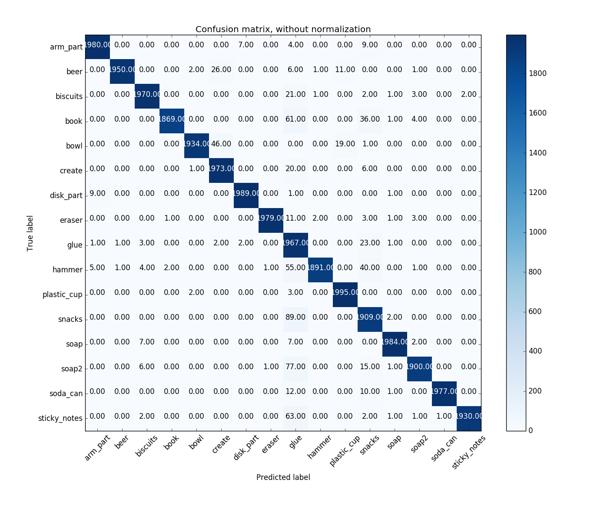
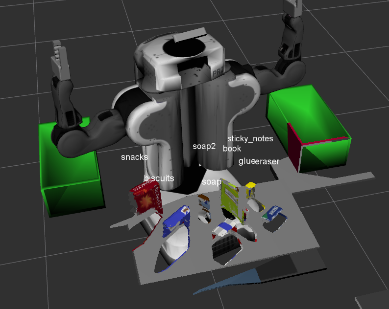

# Project: Perception Pick & Place Writeup

#### Student: Chaichangkun

#### Email: sychaichangkun@gmail.com

#### Github: https://github.com/sychaichangkun

---

# Required Steps for a Passing Submission:
1. Extract features and train an SVM model on new objects (see `pick_list_*.yaml` in `/pr2_robot/config/` for the list of models you'll be trying to identify).
2. Write a ROS node and subscribe to `/pr2/world/points` topic. This topic contains noisy point cloud data that you must work with.
3. Use filtering and RANSAC plane fitting to isolate the objects of interest from the rest of the scene.
4. Apply Euclidean clustering to create separate clusters for individual items.
5. Perform object recognition on these objects and assign them labels (markers in RViz).
6. Calculate the centroid (average in x, y and z) of the set of points belonging to that each object.
7. Create ROS messages containing the details of each object (name, pick_pose, etc.) and write these messages out to `.yaml` files, one for each of the 3 scenarios (`test1-3.world` in `/pr2_robot/worlds/`).  See the example `output.yaml` for details on what the output should look like.  
8. Submit a link to your GitHub repo for the project or the Python code for your perception pipeline and your output `.yaml` files (3 `.yaml` files, one for each test world).  You must have correctly identified 100% of objects from `pick_list_1.yaml` for `test1.world`, 80% of items from `pick_list_2.yaml` for `test2.world` and 75% of items from `pick_list_3.yaml` in `test3.world`.
9. Congratulations!  Your Done!

# Extra Challenges: Complete the Pick & Place
7. To create a collision map, publish a point cloud to the `/pr2/3d_map/points` topic and make sure you change the `point_cloud_topic` to `/pr2/3d_map/points` in `sensors.yaml` in the `/pr2_robot/config/` directory. This topic is read by Moveit!, which uses this point cloud input to generate a collision map, allowing the robot to plan its trajectory.  Keep in mind that later when you go to pick up an object, you must first remove it from this point cloud so it is removed from the collision map!
8. Rotate the robot to generate collision map of table sides. This can be accomplished by publishing joint angle value(in radians) to `/pr2/world_joint_controller/command`
9. Rotate the robot back to its original state.
10. Create a ROS Client for the “pick_place_routine” rosservice.  In the required steps above, you already created the messages you need to use this service. Checkout the [PickPlace.srv](https://github.com/udacity/RoboND-Perception-Project/tree/master/pr2_robot/srv) file to find out what arguments you must pass to this service.
11. If everything was done correctly, when you pass the appropriate messages to the `pick_place_routine` service, the selected arm will perform pick and place operation and display trajectory in the RViz window
12. Place all the objects from your pick list in their respective dropoff box and you have completed the challenge!
13. Looking for a bigger challenge?  Load up the `challenge.world` scenario and see if you can get your perception pipeline working there!

## [Rubric](https://review.udacity.com/#!/rubrics/1067/view) Points
### Here I will consider the rubric points individually and describe how I addressed each point in my implementation.  

---
### Writeup / README

#### 1. Provide a Writeup / README that includes all the rubric points and how you addressed each one.  You can submit your writeup as markdown or pdf.  

You're reading it!

### Exercise 1, 2 and 3 pipeline implemented
#### 1. Complete Exercise 1 steps. Pipeline for filtering and RANSAC plane fitting implemented.
[Exercise 1](https://github.com/sychaichangkun/RoboND-Perception-Exercises/tree/master/Exercise-1)  is completed with **Voxal Grid Filter**, **PassThrough Filter**, **RANSAC Plane Segmentation** and **Inliers/Outliners Extraction** sequantially applied to the point cloud. Finally the objects and the table are extracted.

#### 2. Complete Exercise 2 steps: Pipeline including clustering for segmentation implemented.  
As you can see the [template.py](https://github.com/sychaichangkun/RoboND-Perception-Exercises/blob/master/Exercise-2/sensor_stick/scripts/template.py) file in [Exercise 2](https://github.com/sychaichangkun/RoboND-Perception-Exercises/tree/master/Exercise-2), the pipeline includes all steps in [Exercise 1](https://github.com/sychaichangkun/RoboND-Perception-Exercises/tree/master/Exercise-1) and **Euclidean Clustering**, which uses k-d tree to separate cloud points into different clusters. Then the objects, table and colored clusters for visualization are published as ROS messages.

#### 3. Complete Exercise 3 Steps.  Features extracted and SVM trained.  Object recognition implemented.
[Exercise 3](https://github.com/sychaichangkun/RoboND-Perception-Exercises/tree/master/Exercise-3) does a very meaningful job on capturing features and classifying objects. The pipeline is as follows:
* Capture features of the 7 models(beer, bowl, create, disk part, hammer, plastic cup, soda can) with both color and normal to surface. The features are filled in a histgram with 32 bins as one channel(256 in total).

* Train SVM classifier with this dataset, choose a kernal of **linear** and gamma and C as default. The validation and testing accuracy seems pretty good(~97%).

* Predict the cloud points with this well trained SVM classifier.
As you can see in the pictures below, every object is correctly recognized.

###### NOTE: In Perception-Project, the features are captured from all 16 objects and each with 2000 features. This is an extremly huge dataset. As shown below.

### Pick and Place Setup

#### 1. For all three tabletop setups (`test*.world`), perform object recognition, then read in respective pick list (`pick_list_*.yaml`). Next construct the messages that would comprise a valid `PickPlace` request output them to `.yaml` format.

Applying the long-time trained SVM classifier to the cloud point, the objects are all precisely recognized.

The output yaml files are in [scripts](./pr2_robot/scripts) folder.
